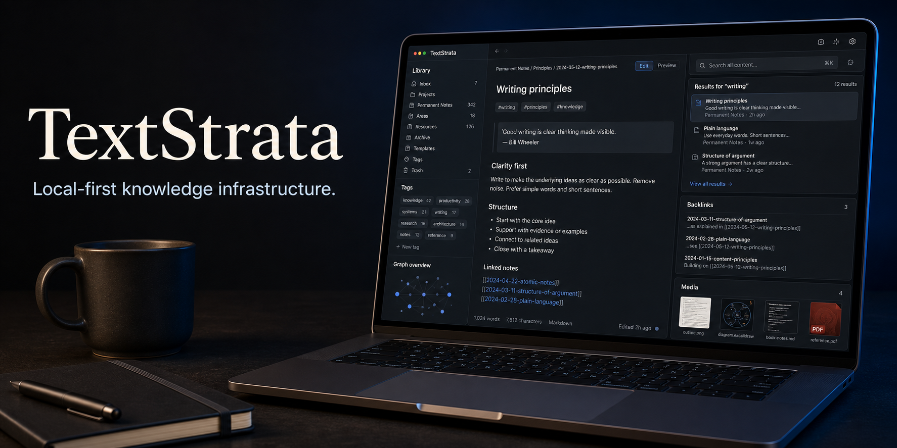

# TextStrata

<p align="center">
  
</p>

A machine-first knowledge substrate. Markdown is the storage format; TextStrata is the system. Content is typed, policy-aware, deterministically ingested, cross-linked from cheap signals, and indexed for retrieval. Presentation skins (Hugo, TUI, web) sit on top and may restyle but never change meaning, link targets, accessibility order, policy, or retrieval metadata.

This repository is the **substrate** and the standalone runtime. It stores normalized knowledge, exposes the local web and MCP surfaces, runs its own acquisition queue, and can optionally enable richer converters through install extras.

## What's here

| Module | Responsibility |
|---|---|
| `models.py` | Typed content core: `ContentType`, `HandlingMode`, `PreservationMode`, and the extensible `TextStrataItem` (open `extra` map for unpromoted fields). |
| `frontmatter.py` | Deterministic YAML front-matter parsing that **merges stacked blocks** instead of dropping them, records scalar conflicts, and salvages invalid-YAML blocks (e.g. an unquoted colon in a title). |
| `classify.py` | Deterministic (no-AI) content-class detection, additive tag suggestion, and policy suggestion from a fixed taxonomy. |
| `validate.py` | The enforcement gate: structural checks and contradictory-policy rejection before publication. |
| `store.py` | Filesystem store keeping the **original verbatim** separate from the **normalized** published copy; atomic publication. |
| `ingest.py` | The ingestion front door wiring the pipeline together. |
| `presentation/` | Skin-driven text and HTML rendering over the same semantic item. |
| `linking.py` | Deterministic, explainable cross-links (dependency > reference > shared tag > same type). |
| `similarity.py` | Deterministic, no-AI content similarity (stdlib TF-IDF cosine + tag Jaccard), graph authority scoring (PageRank + HITS), and emergent topic clusters (label propagation). Produces a 0-100 `knowledge_score` per item and a symbiotic link-back mesh where documents lend each other weight. |
| `catalog.py` | Rebuildable SQLite **FTS5** retrieval index; `rescan()` rebuilds from the normalized store. |
| `mcp_server.py` | Dependency-free MCP-style stdio server exposing search, preview, ingest, and render tools. |
| `gateway.py` | Optional allowlisted gateway for importing from an external acquisition service. |
| `operations.py` | Revision settings and the stable self-updating operations/error reference article. |

## Ingestion pipeline

Deterministic and policy-driven before any AI assistance:

1. parse + merge every front-matter block (nothing dropped)
2. detect content class
3. suggest tags from rules and the taxonomy
4. suggest handling/preservation policy
5. store the original verbatim, separate from transformed output
6. validate; publish the normalized copy only if it passes
7. return the result with its policy attached

## Design invariants

* The filesystem is authoritative; the catalog is a disposable derived index.
* The original is never rewritten (`preserve_exact`), regardless of normalization.
* First front-matter declaration wins; later blocks may only add, an upstream tool cannot silently change an item's identity by appending a block.
* Cross-links are explainable: every edge names the signal that produced it.
* Presentation skins may change visuals, but not meaning, ordering, or metadata.

## Requirements

Core TextStrata requires:

- Python 3.10 or newer
- PyYAML
- SQLite with FTS5 support (included in standard CPython builds on supported platforms)

The core installation does not require Docker, Node.js, Ollama, an MCP client,
embeddings, or model downloads. Optional acquisition capabilities are separate:

| Capability | Install | Additional system tool | Model download |
|---|---|---|---|
| Documents | `pip install -e '.[documents]'` | None beyond the package | No |
| Images and OCR | `pip install -e '.[images]'` | `tesseract-ocr` for OCR | No |
| YouTube | `pip install -e '.[youtube]'` | None | No |
| Local audio transcription | `pip install -e '.[audio]'` | `ffmpeg` | Possibly, on first transcription |
| AI-assisted commands | No core extra | Ollama, configured separately | Yes, when you explicitly pull a model |

TextStrata detects optional capabilities at runtime. Missing optional tools do
not make the local core unhealthy, and TextStrata never installs packages,
starts external services, or downloads models automatically.

## Usage

```bash
pip install -e .                         # core only, small and portable
pip install -e '.[documents,images,youtube]'  # opt-in acquisition packs
# add '.[audio]' as well if you want local Whisper transcription

# Docker defaults to the core-only textstrata-lite image. The full profile passes
# explicit capability packs at build time; no large models or media corpora
# belong in the repository or the base image.
docker compose --profile lite build textstrata-lite
docker compose --profile lite run --rm textstrata-lite web
# Optional full profile: converters plus a separately managed Ollama companion.
docker compose --profile full build textstrata
docker compose --profile full up textstrata ollama

python -m textstrata --workspace ./textstrata-store init
python -m textstrata --workspace ./textstrata-store ingest seed/textstrata-architecture.md
python -m textstrata --workspace ./textstrata-store preview seed/textstrata-architecture.md
python -m textstrata --workspace ./textstrata-store render ITEM_ID --format html > item.html
python -m textstrata rebuild
python -m textstrata search "policy driven ingestion"
python -m textstrata links ITEM_ID
python -m textstrata score               # ranked knowledge scores (0-100)
python -m textstrata score --clusters    # emergent topic clusters
python -m textstrata mcp

# Run the web surface on any available local port.
PORT=YOUR_AVAILABLE_PORT
TEXTSTRATA_HOST=127.0.0.1 TEXTSTRATA_PORT=$PORT \
python -m textstrata web
curl http://127.0.0.1:$PORT/whoami
```

The web collection reads normalized items from the workspace selected by
`--workspace` or the local configuration file. An empty workspace shows an
explicit setup message instead of a blank collection. Keep the workspace on a
durable path; temporary roots are only appropriate for tests.

The Docker **lite** profile is the portable core and does not start Ollama.
The **full** profile adds document/image/YouTube/audio acquisition packages and
an optional Ollama companion; it still does not pull a model automatically.

Run the tests:

```bash
PYTHONPATH=src python -m unittest discover -s tests -v
```

## Presentation skins

`presentation/` currently ships a warm editorial skin and a darker console skin. They preserve the semantic contract while allowing the same content to look like a wiki, operator console, or dense reference surface.

## MCP server

`mcp_server.py` is a dependency-free stdio server for local agents. It exposes tools for search, list, read, preview, ingest, and render.

MCP is shipped with the runtime but remains an explicit opt-in command: `python -m textstrata mcp`. It does not require Ollama, embeddings, or model downloads.

The optional control plane supports checksum-manifested Markdown backup and
approved remote ingest through host-managed `rclone`. See
[docs/control-plane.md](docs/control-plane.md) and
`config/control.example.json`; credentials and personal Drive configuration
stay outside the repository.

## Web ingestion and operations

The expandable **Add knowledge** workspace accepts pasted Markdown directly and natively queues URLs, YouTube videos/channels, documents, images, and text uploads into TextStrata. Converted output lands in the same typed store as direct text ingestion. Direct text is limited to 5 MiB; queued acquisitions are limited to 64 MiB. Browser writes are same-origin only.

The collapsible **Operations** menu contains queue stop/delete/purge controls, local trash, retention settings, appearance controls, channel purge, capability recheck, and one-to-three retained revisions. Destructive requests require both an explicit warning dialog and the `X-TextStrata-Confirm` server token. Every structured error links to `system.operations-error-reference`, whose observed-error block updates deterministically while leaving explanatory prose available to an AI MCP editor.

## Optional external acquisition gateway

TextStrata operates independently. An optional gateway can import or mirror
from an external acquisition service for installations that already have one,
but the runtime does not depend on a second server for uploads, queueing,
revisions, or library rendering.

## Status

The substrate, MCP surface, acquisition workspace, media handling, operational
controls, backup control plane, and bounded revision history are implemented.
AI-assisted classification remains an optional layer above the deterministic
boundary.
